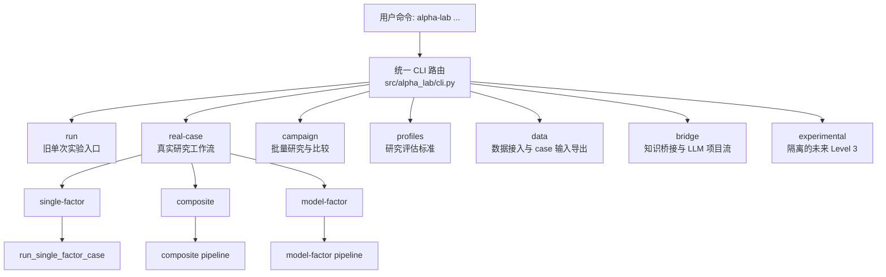
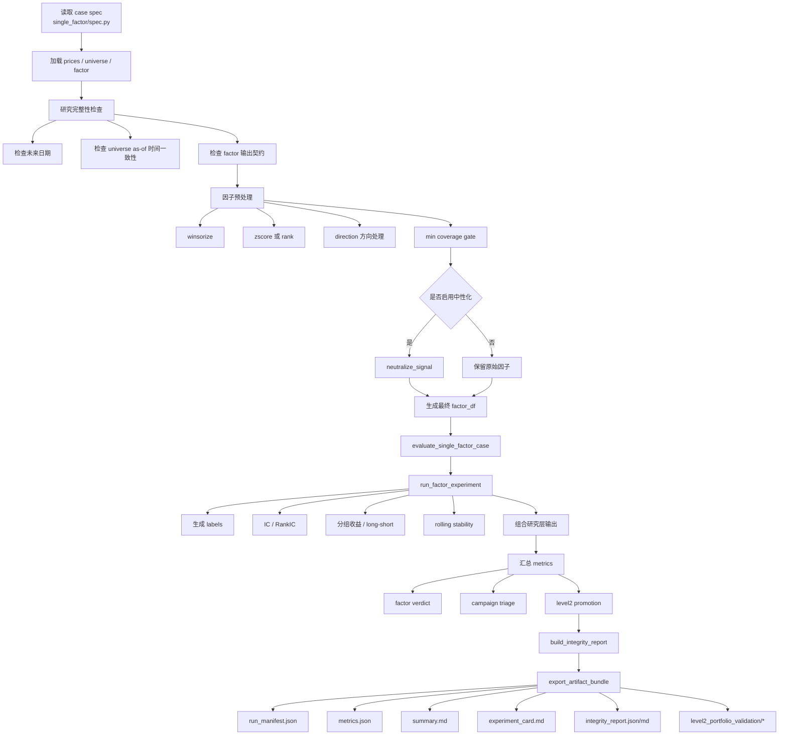
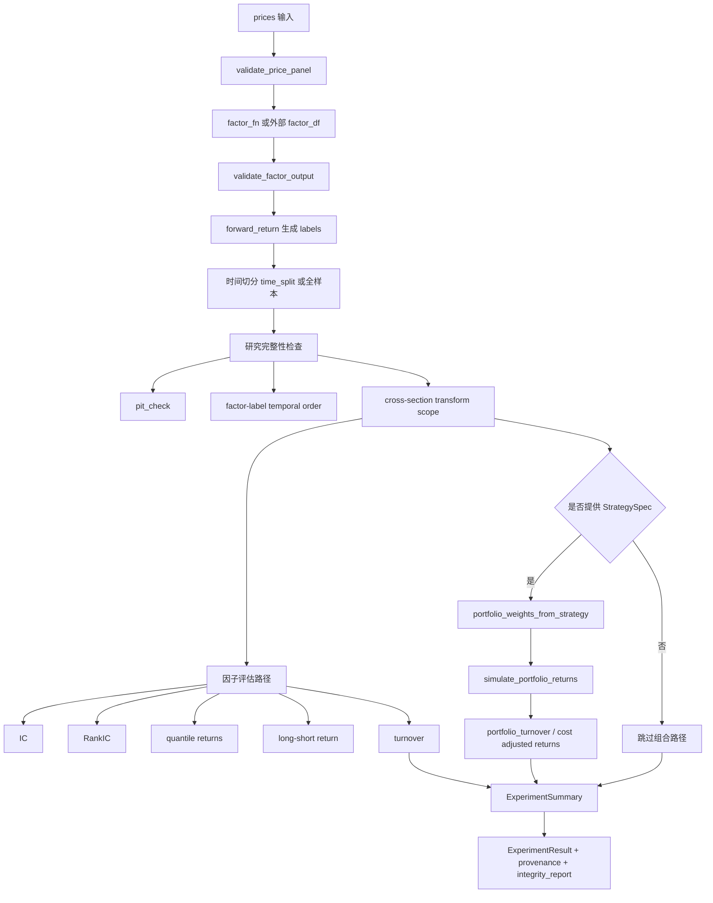
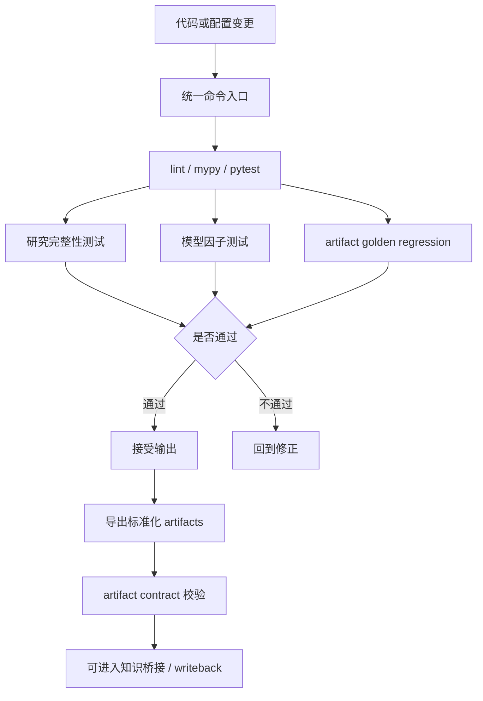

# Alpha Lab 运行逻辑流程图

本文用于在 Cursor 中演示 `alpha-lab` 的运行逻辑。重点展示三件事：

1. 系统入口如何路由到不同工作流
2. 单因子 `real-case` 如何完成从输入到评估再到产物导出
3. 为什么这套流程能体现工程能力，而不是“直接让大模型写代码”

## 1. 顶层运行逻辑

### 讲解重点

- `cli.py` 是统一入口，不是很多脚本各自为战。
- 核心默认主线是 `real-case / campaign / profiles / data / bridge`。
- `experimental` 被单独隔离，避免执行语义污染默认 Level 1/2 工作流。

对应代码：

- [cli.py](/home/yukun_zhao/quant/projects/alpha-lab/src/alpha_lab/cli.py)

## 2. 单因子 Real-Case 端到端运行逻辑

这是最适合面试现场展示的一条主线。

### 讲解重点

- 这里不是“输入文件然后直接输出结果”，中间有显式的研究完整性检查。
- 中性化、预处理、coverage gate 都是明确步骤，不是隐含在 notebook 里。
- 评估不是只看一个 `mean_ic`，而是同时形成 verdict、campaign triage 和 Level 2 promotion。
- 最后输出的是标准化 artifact bundle，而不是零散 csv。

对应代码：

- [single_factor/spec.py](/home/yukun_zhao/quant/projects/alpha-lab/src/alpha_lab/real_cases/single_factor/spec.py)
- [single_factor/pipeline.py](/home/yukun_zhao/quant/projects/alpha-lab/src/alpha_lab/real_cases/single_factor/pipeline.py)
- [single_factor/evaluate.py](/home/yukun_zhao/quant/projects/alpha-lab/src/alpha_lab/real_cases/single_factor/evaluate.py)
- [single_factor/artifacts.py](/home/yukun_zhao/quant/projects/alpha-lab/src/alpha_lab/real_cases/single_factor/artifacts.py)

## 3. `run_factor_experiment` 内部逻辑

如果面试官追问“底层实验引擎具体做了什么”，就展示这张图。

### 讲解重点

- `run_factor_experiment` 是统一实验引擎，很多上层流程最终都会落到这里。
- 先校验输入，再做标签，再做完整性检查，再做评估。
- 组合层是可选路径，且通过 `StrategySpec` 显式触发。

对应代码：

- [experiment.py](/home/yukun_zhao/quant/projects/alpha-lab/src/alpha_lab/experiment.py)
- [strategy.py](/home/yukun_zhao/quant/projects/alpha-lab/src/alpha_lab/strategy.py)
- [portfolio_research.py](/home/yukun_zhao/quant/projects/alpha-lab/src/alpha_lab/portfolio_research.py)

## 4. 质量控制与输出治理逻辑

这张图适合用来回答“你怎么证明不是让 LLM 乱写一通”。

### 讲解重点

- 我对 LLM 输出的接受标准不是“看起来像对”，而是“能否通过验证链”。
- golden regression 说明用户可见产物也受控，不允许静默漂移。
- artifact contract 说明结果不是随意 JSON，而是结构化标准产物。

对应代码：

- [Makefile](/home/yukun_zhao/quant/projects/alpha-lab/Makefile)
- [artifact_contracts.py](/home/yukun_zhao/quant/projects/alpha-lab/src/alpha_lab/artifact_contracts.py)
- [test_research_integrity_integration.py](/home/yukun_zhao/quant/projects/alpha-lab/tests/test_research_integrity_integration.py)
- [test_model_factor_core.py](/home/yukun_zhao/quant/projects/alpha-lab/tests/test_model_factor_core.py)
- [test_artifact_golden_regression.py](/home/yukun_zhao/quant/projects/alpha-lab/tests/test_artifact_golden_regression.py)

## 5. 在 Cursor 里怎么展示

建议按下面顺序打开：

1. [README.md](/home/yukun_zhao/quant/projects/alpha-lab/README.md)
2. [docs/architecture.md](/home/yukun_zhao/quant/projects/alpha-lab/docs/architecture.md)
3. [src/alpha_lab/cli.py](/home/yukun_zhao/quant/projects/alpha-lab/src/alpha_lab/cli.py)
4. [src/alpha_lab/real_cases/single_factor/spec.py](/home/yukun_zhao/quant/projects/alpha-lab/src/alpha_lab/real_cases/single_factor/spec.py)
5. [src/alpha_lab/real_cases/single_factor/pipeline.py](/home/yukun_zhao/quant/projects/alpha-lab/src/alpha_lab/real_cases/single_factor/pipeline.py)
6. [src/alpha_lab/experiment.py](/home/yukun_zhao/quant/projects/alpha-lab/src/alpha_lab/experiment.py)
7. [src/alpha_lab/research_integrity/asof.py](/home/yukun_zhao/quant/projects/alpha-lab/src/alpha_lab/research_integrity/asof.py)
8. [src/alpha_lab/research_integrity/leakage_checks.py](/home/yukun_zhao/quant/projects/alpha-lab/src/alpha_lab/research_integrity/leakage_checks.py)
9. [src/alpha_lab/real_cases/single_factor/artifacts.py](/home/yukun_zhao/quant/projects/alpha-lab/src/alpha_lab/real_cases/single_factor/artifacts.py)
10. [tests/test_research_integrity_integration.py](/home/yukun_zhao/quant/projects/alpha-lab/tests/test_research_integrity_integration.py)
11. [tests/test_model_factor_core.py](/home/yukun_zhao/quant/projects/alpha-lab/tests/test_model_factor_core.py)
12. [tests/test_artifact_golden_regression.py](/home/yukun_zhao/quant/projects/alpha-lab/tests/test_artifact_golden_regression.py)

## 6. 面试时的一句话总结

“我展示的不是让大模型替我写几段代码，而是把 LLM 纳入一个受控研究系统。需求先结构化，代码按边界生成，输出必须经过研究完整性检查、测试回归、artifact 契约校验，最后才能进入正式研究产物和知识沉淀流程。” 
